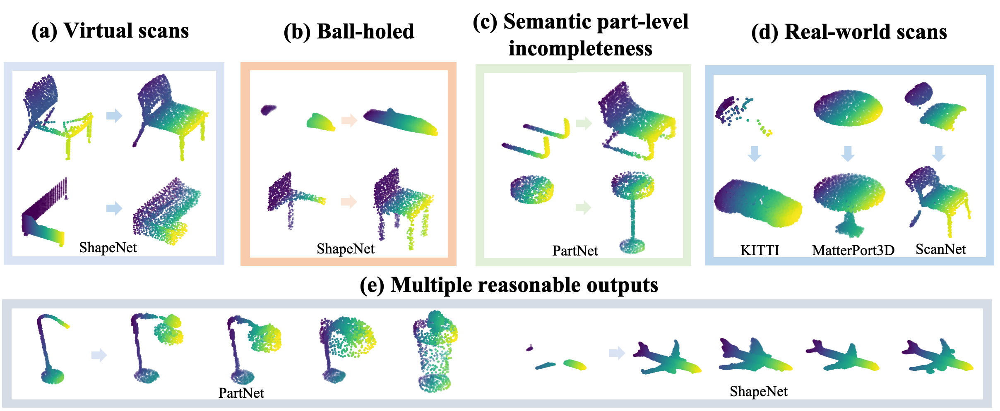

# ShapeInversion
## Paper
Junzhe Zhang, Xinyi Chen, Zhongang Cai, Liang Pan, Haiyu Zhao, Shuai Yi, Chai Kiat Yeo, Bo Dai, Chen Change Loy "Unsupervised 3D Shape Completion through GAN Inversion" CVPR 2021
* Project page: [link](https://junzhezhang.github.io/projects/ShapeInversion/)
* Paper: [link](https://arxiv.org/abs/2104.13366)


## Results



## Setup
### Environment
```
conda create -n shapeinversion python=3.7
conda activate shapeinversion
pip install torch==1.2.0 torchvision==0.4.0
pip install plyfile h5py Ninja matplotlib scipy
```
### Datasets
Our work is extensively evaluated with several existing datasets. For the virtual scan benchmark (derived from ShapeNet), we use [CRN's dataset](https://drive.google.com/file/d/1MzVZLhXOgfaLZjn1jDrwuiCB-XCfaB-w/view?usp=sharing). We would suggest you to get started with this dataset. For ball-holed partial shapes, we refer to [PF-Net](https://github.com/zztianzz/PF-Net-Point-Fractal-Network). For PartNet dataset, we download from [MPC](https://github.com/ChrisWu1997/Multimodal-Shape-Completion). For real scans processed from KITTI, MatterPort3D, and ScanNet, we get from [pcl2pcl](https://github.com/xuelin-chen/pcl2pcl-gan-pub).


## Get started
We provide pretrained tree-GAN models for you to directly start with the inversion stage. You can download them from [Google drive](https://drive.google.com/drive/folders/1FA29POuh5hlg50ulCxSMjCImbgI6wxvR) or [Baidu cloud](https://pan.baidu.com/s/1VkRSHuS8hpbcXPzvnN1LfQ) (password: w1n9), and put them to the `pretrained_models` folder.
### Shape completion 
You can specify other class and other datasets, like real scans provided by pcl2pcl.
```
python trainer.py \
--dataset CRN \
--class_choice chair \
--inversion_mode completion \
--mask_type k_mask \
--save_inversion_path ./saved_results/CRN_chair \
--ckpt_load pretrained_models/chair.pt \
--dataset_path <your_dataset_directory>
```
### Evaluating completion results
For datasets with GT, such as the above `CRN_chair`:
```
python eval_completion.py \
--eval_with_GT true \
--saved_results_path saved_results/CRN_chair
```
For datasets without GT:
```
python eval_completion.py \
--eval_with_GT false \
--saved_results_path <your_results_on_KITTI>
```
### Giving multiple valid outputs
ShapeInversion is able to provide multiple valid complete shapes, especially when extreme incompleteness that causes ambiguity.
```
python trainer.py \
--dataset CRN \
--class_choice chair \
--inversion_mode diversity \
--save_inversion_path ./saved_results/CRN_chair_diversity \
--ckpt_load pretrained_models/chair.pt \
--dataset_path <your_dataset_directory>
```
### Shape jittering
ShapeInversion is able to change an object into other plausible shapes of different geometries.
```
python trainer.py \
--dataset CRN \
--class_choice plane \
--save_inversion_path ./saved_results/CRN_plane_jittering  \
--ckpt_load pretrained_models/plane.pt \
--inversion_mode jittering \
--iterations 30 30 30 30 \
--dataset_path <your_dataset_directory>
```
### Shape morphing
ShapeInversion enables morphing between two shapes.
```
python trainer.py \
--dataset CRN \
--class_choice chair \
--save_inversion_path ./saved_results/CRN_chair_morphing  \
--ckpt_load pretrained_models/chair.pt \
--inversion_mode morphing \
--dataset_path <your_dataset_directory>
```
### Pretraining
You can also pretrain tree-GAN by yourself.
```
python pretrain_treegan.py \
--split train \
--class_choice chair \
--FPD_path ./evaluation/pre_statistics_chair.npz \
--ckpt_path ./pretrain_checkpoints/chair \
--knn_loss True \
--dataset_path <your_dataset_directory>
```

NOTE:
- The inversion stage supports distributed training by simply adding `--dist`. It is tested on [slurm](https://slurm.schedmd.com/) as well.
- The hyperparameters provided may not be optimal, feel free to tune them.
- Smaller batch size for pretraining is totally fine.


# Acknowledgement
The code is in part built on [tree-GAN]() and [DGP](https://github.com/XingangPan/deep-generative-prior). Besides, CD and EMD are borrowed from [ChamferDistancePytorch](https://github.com/ThibaultGROUEIX/ChamferDistancePytorch) and [MSN](https://github.com/Colin97/MSN-Point-Cloud-Completion) respectively, both of which are included in the `external` folder for convenience.


## Citation

```  
@inproceedings{zhang2021unsupervised,
    title = {Unsupervised 3D Shape Completion through GAN Inversion},
    author = {Zhang, Junzhe and Chen, Xinyi and Cai, Zhongang and Pan, Liang and Zhao, Haiyu 
    and Yi, Shuai and Yeo, Chai Kiat and Dai, Bo and Loy, Chen Change},
    booktitle = {CVPR},
    year = {2021}}